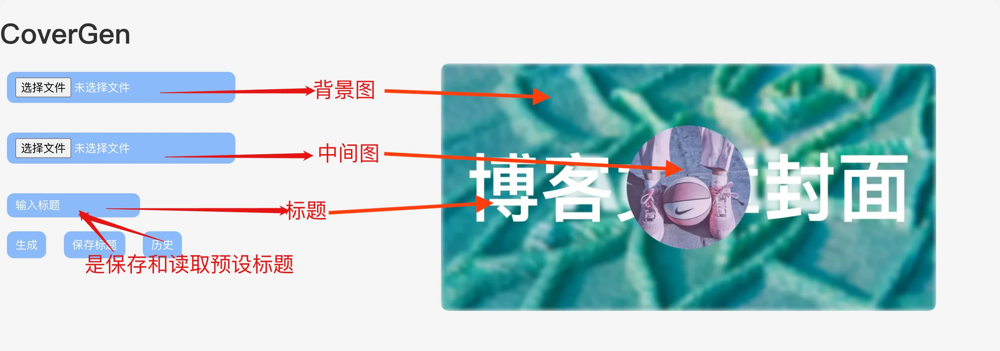

# CoverGen
CoverGen - 简单易上手的博客文章封面生成器

# 在线使用
[https://timigomen.github.io/CoverGen/](https://timigomen.github.io/CoverGen/)

# 设计理念
参考[@zhheo](https://blog.zhheo.com/p/463d306b.html)，采用ZHHEO的第七代封面设计

# 固定一个核心标准
你可以自己设立一个标准。你首先要思考
- 我的博客是什么类型，都谁在看？
- 我的博客受众喜欢什么配色或者风格？
- 我的博客受众浏览文章列表的眼动路径期望是怎样的？
- 预想核心标准，然后再设置当下时期自己喜欢的样式。保持封面的统一可以让博客看起来更加和谐和令人舒适。

# 使用说明

# 示例

# Todo
- [√]七代框架
- [√]保存
- [ ]背景色
- [ ]字体自定义